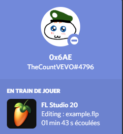

# fls-discordRichPresence
This is a Discord Rich Presence for FL Studio 20. It will show this Rich Presence on your Discord profile when making music on FL Studio !



## Requierements
To use this tool you'll need :
  - NodeJS (Lastest Version)
  - Git (optional)
  - Discord (Already launched when starting index.js)
  - FL Studio 20 (I think I don't have to say why...)

## Installation

- Using Git :

```bat
git clone https://github.com/TheCountVevo/fls-discordRichPresence.git
cd fls-discordRichPresence
node index.js
```

- Without Git :
1) Download the repository and extract it where you want
2) Open the folder of the repository
3) Run `node index.js` in a terminal

## Disclaimer

This project is under AGPL 3.0 license, if you want to make changes on my program, you'r free to do it, but you have the **OBLIGATION** to publish your modifications. If you have maked any changes, send me your project on Discord (TheCountVEVO#4796) or open an Issue and I'll be glad to talk about your work with you.
